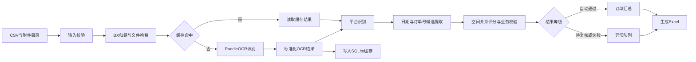

# 电商订单下单日期识别功能开发文档

> 文档状态：开发准备版  
> 适用工程：报销附件整理工具  
> 目标平台：Windows 10/11 x64  
> 当前工程基线：Python 3.11.15、Tkinter、PyInstaller 6.22.2  
> OCR 技术路线：PaddleOCR 3.x，本地 CPU 推理

## 1. 项目目标

在现有“报销附件整理工具”中增加电商订单下单日期识别能力。程序批量读取“订单截图”目录中的图片和 PDF，按 `BX...` 报销编号归组，使用 PaddleOCR 提取带坐标和置信度的文字，再通过平台规则识别真正的下单时间，最终生成可筛选、可追溯、可人工复核的 Excel 报告。

### 1.1 第一版交付目标

1. 支持 JPG、JPEG、PNG、BMP、PDF。
2. 支持按 `BX编号`、`BX编号(N)` 文件名归组。
3. 使用本地 PaddleOCR，不上传附件，不依赖收费 API。
4. 区分下单、付款、发货、完成、退款和开票日期。
5. 高置信结果自动通过；不确定结果进入“待人工复核”。
6. 生成订单日期汇总、附件识别明细、待人工复核和运行统计四张工作表。
7. 支持 OCR 缓存、增量处理和中断后继续运行。
8. 保持现有附件整理、重命名和 CSV 汇总功能可用。
9. 最终交付可双击运行的 Windows 程序及模型目录。

### 1.2 第一版不做

1. 不训练或微调 PaddleOCR 模型。
2. 不自动登录淘宝、京东等平台抓取订单。
3. 不调用大模型判断日期。
4. 不用付款时间代替缺失的下单时间。
5. 不在未确认前覆盖原始 CSV 或原始附件。
6. 不承诺所有文件都自动通过；优先保证自动通过结果的正确率。

## 2. 业务口径

### 2.1 下单时间定义

默认业务定义：订单在电商平台创建、提交或生成的时间。

可作为下单时间的标签：

- 下单时间
- 下单日期
- 订单创建时间
- 创建时间
- 提交订单时间
- 订单时间
- 交易创建时间（仅在对应平台规则明确时）

不得作为下单时间的标签：

- 付款时间、支付时间
- 发货时间
- 收货时间、签收时间
- 完成时间、交易成功时间
- 退款时间、售后时间
- 开票日期
- 打印日期
- 截图时间、手机状态栏时间
- 优惠券有效期、预计送达时间

### 2.2 多订单处理

- 一个 BX 编号可以对应多个附件。
- 一个 BX 编号可以对应多个订单。
- 能识别订单号时，以“BX编号 + 订单号”为订单唯一键。
- 不能识别订单号但存在多个明确下单时间时，每个时间保留一条订单明细，并标记“订单号缺失”。
- 多张附件结果冲突时不得简单选择最早或最晚日期，必须进入复核。

## 3. 现有工程基线与改造原则

现有工程包含：

- `rename_invoices_orders.py`：CSV 解析、BX 附件匹配、复制重命名和 `summary.csv` 输出。
- `invoice_attachment_gui.py`：Tkinter GUI、后台线程、日志和进度提示。
- `build.ps1`：调用 PyInstaller 打包单文件 Windows 程序。
- `app.manifest`：高 DPI、长路径和普通用户权限设置。

改造原则：

1. 不把 OCR、规则、缓存和 Excel 逻辑继续堆进现有两个脚本。
2. 保留 `rename_invoices_orders.py` 的现有命令行参数和行为，避免旧流程回归。
3. 把共享的 CSV 记录和 BX 文件匹配能力抽成独立模块，再由旧流程和 OCR 流程共同调用。
4. OCR 引擎只负责识别文字，不在 OCR 层写平台业务判断。
5. 所有规则、阈值和版本都可追溯，禁止出现无法解释的自动填值。

## 4. 技术选型

| 领域 | 选型 | 说明 |
|---|---|---|
| 语言 | Python 3.11 x64 | 与当前构建环境一致 |
| GUI | Tkinter/ttk | 保留当前界面技术 |
| OCR | PaddleOCR 3.x | 使用官方通用 OCR 产线 |
| 推理设备 | CPU | 默认兼容普通办公电脑 |
| 推理引擎 | `paddle_static` 优先 | 官方文档建议多数场景优先使用 |
| OCR 模型 | PP-OCRv6 中文模型候选 | 最终名称和版本在兼容性验证阶段锁定 |
| 缓存 | SQLite | 本地、免部署、支持事务和增量处理 |
| Excel | openpyxl | 生成多工作表、样式、日期类型和超链接 |
| 配置 | JSON | Python 原生读取，便于随 EXE 分发 |
| 测试 | pytest | 单元、集成和回归测试 |
| 打包 | PyInstaller | 延续当前发布方式 |

### 4.1 版本锁定策略

不得在正式构建中使用无版本上限的 `paddleocr`、`paddlepaddle`、`paddlex`。开发阶段先完成版本兼容性验证，再将通过测试的完整版本写入 `requirements-runtime.txt` 和 `requirements-build.txt`。

需要锁定并记录：

- Python 版本
- PaddleOCR 版本
- PaddlePaddle CPU 版本
- PaddleX 版本（由所选 PaddleOCR 版本决定）
- openpyxl、Pillow、PyInstaller 版本
- OCR 检测、识别和方向模型名称及文件哈希

## 5. 系统架构



## 6. 建议目录结构

```text
项目根目录/
├─ invoice_attachment_gui.py
├─ rename_invoices_orders.py
├─ order_date_cli.py
├─ requirements-runtime.txt
├─ requirements-build.txt
├─ build.ps1
├─ app.manifest
├─ order_date/
│  ├─ __init__.py
│  ├─ models.py
│  ├─ input_loader.py
│  ├─ file_grouper.py
│  ├─ hashing.py
│  ├─ ocr_engine.py
│  ├─ ocr_normalizer.py
│  ├─ platform_detector.py
│  ├─ candidate_extractor.py
│  ├─ rule_scorer.py
│  ├─ aggregator.py
│  ├─ cache_db.py
│  ├─ excel_report.py
│  ├─ pipeline.py
│  ├─ errors.py
│  └─ rules/
│     ├─ common.json
│     ├─ taobao.json
│     ├─ jd.json
│     ├─ pinduoduo.json
│     └─ douyin.json
├─ models/
│  ├─ manifest.json
│  ├─ detection/
│  ├─ recognition/
│  └─ orientation/
└─ tests/
   ├─ unit/
   ├─ integration/
   ├─ fixtures/
   └─ golden/
```

## 7. 核心数据模型

数据对象放在 `order_date/models.py`，业务模块之间只传递明确对象，不传递任意字典。

```python
@dataclass(frozen=True)
class SourceFile:
    bx_id: str
    path: Path
    relative_path: str
    file_hash: str
    extension: str
    page_index: int | None = None

@dataclass(frozen=True)
class OCRTextBlock:
    text: str
    confidence: float
    polygon: tuple[tuple[float, float], ...]
    page_index: int

@dataclass(frozen=True)
class DateCandidate:
    raw_text: str
    normalized_datetime: datetime
    label: str | None
    source_block_indexes: tuple[int, ...]
    base_score: float
    negative_labels: tuple[str, ...]

@dataclass
class ExtractionResult:
    bx_id: str
    source_file: str
    platform: str
    order_number: str | None
    order_datetime: datetime | None
    confidence_score: float
    status: str
    evidence_text: str
    rule_version: str
    error_code: str | None = None
```

### 7.1 状态枚举

| 状态 | 含义 |
|---|---|
| `AUTO_ACCEPTED` | 高置信自动通过 |
| `NEEDS_REVIEW` | 有候选但存在不确定性 |
| `NO_ORDER_DATE` | OCR 成功但没有下单日期 |
| `OCR_FAILED` | OCR 失败或文件无法读取 |
| `CONFLICT` | 多附件或多候选冲突 |
| `DUPLICATE` | 内容与已处理文件完全相同 |
| `SKIPPED_CACHE` | 直接复用缓存结果 |

## 8. PaddleOCR 接入设计

### 8.1 初始化

PaddleOCR 实例只能在工作线程中初始化一次并复用，不能每张图片创建一次实例。

目标初始化参数：

```python
PaddleOCR(
    lang="ch",
    ocr_version="PP-OCRv6",
    device="cpu",
    use_doc_orientation_classify=True,
    use_doc_unwarping=False,
    use_textline_orientation=False,
    cpu_threads=<配置值>,
)
```

上述写法省略 `engine`，使用官方默认的本地 `paddle_static` 推理引擎。只有切换到 `transformers` 或 `onnxruntime` 时才显式传入 `engine`。

最终参数以兼容性验证结果为准。若 PP-OCRv6 在当前 Windows + PyInstaller 组合下无法稳定冻结，则优先回退到经测试稳定的 PP-OCRv5，而不是在打包阶段临时拼凑版本。

### 8.2 批量推理

- 使用 `predict_iter()` 增量获取结果，避免大批量文件一次性占用内存。
- 输入可以是图片路径或 PDF 路径。
- 每个结果立即标准化并写入缓存，避免运行中断后全部重做。
- 仅保留业务需要的文字、坐标、置信度、页码和模型元数据，不把大型可视化图写入数据库。
- 调试模式可单独保存带文字框的 OCR 预览图；正式模式默认关闭。

### 8.3 模型目录

正式程序不能依赖首次运行时联网下载模型。开发阶段下载并验证模型后，应复制到发布包的 `models` 目录，并在导入 PaddleOCR 前设置固定缓存路径或显式模型路径。

模型清单 `models/manifest.json` 至少记录：

```json
{
  "ocr_version": "PP-OCRv6",
  "paddleocr_version": "待兼容性验证后锁定",
  "paddlepaddle_version": "待兼容性验证后锁定",
  "models": [
    {"role": "detection", "name": "待锁定", "sha256": "待生成"},
    {"role": "recognition", "name": "待锁定", "sha256": "待生成"},
    {"role": "orientation", "name": "待锁定", "sha256": "待生成"}
  ]
}
```

程序启动时校验模型目录和哈希。缺失时给出明确错误，不静默联网下载。

## 9. OCR 结果标准化

`ocr_normalizer.py` 将 PaddleOCR 版本相关输出转换为内部 `OCRTextBlock`：

1. Unicode NFKC 标准化。
2. 全角数字和标点转半角。
3. 合并日期中被 OCR 分开的年月日和时间片段。
4. 保留原始文字，标准化文字另存，便于审计。
5. 坐标统一为图片原始坐标系。
6. PDF 结果必须保留页码。
7. 过滤纯空白块，但不在此层删除低置信文本。

## 10. 平台规则设计

平台规则使用 JSON，禁止将大批关键词散落在 Python 代码中。

示例：

```json
{
  "platform": "jd",
  "display_name": "京东",
  "version": "1.0.0",
  "positive_keywords": ["京东", "订单编号", "下单时间"],
  "negative_keywords": ["拼多多", "淘宝"],
  "order_date_labels": ["下单时间", "订单创建时间"],
  "weak_order_date_labels": ["订单时间"],
  "excluded_date_labels": ["支付时间", "发货时间", "完成时间"],
  "order_number_patterns": ["订单编号[:：]?\\s*([0-9A-Za-z-]{8,})"]
}
```

平台识别输出：

- 平台名称
- 平台得分
- 命中的正向词
- 命中的负向词
- 使用的规则版本

平台得分接近时标记为 `unknown`，日期仍按统一规则提取。平台名称和平台得分只用于展示、订单号辅助和排查，不参与下单日期候选评分、置信度或审核状态判定。

## 11. 日期候选提取与评分

### 11.1 日期格式

至少支持：

- `YYYY-MM-DD`
- `YYYY/MM/DD`
- `YYYY.MM.DD`
- `YYYY年M月D日`
- 上述格式加 `HH:mm` 或 `HH:mm:ss`

只有月日、没有年份的候选默认不自动通过。OCR 常见字符修正只能在上下文明确时使用，例如日期数字区域内的 `O -> 0`，并且修正会降低置信度并写入证据。

### 11.2 空间关系

每个日期候选与附近文字块计算：

- 是否与正向标签同一行
- 是否位于标签右侧
- 是否位于标签正下方
- 标签与日期的像素距离
- 是否被其他标签隔开
- 附近是否出现负向标签
- 是否位于页面顶部状态栏区域

### 11.3 初始评分表

以下分值只作为开发初值，必须由黄金样本校准：

| 条件 | 分值 |
|---|---:|
| 精确命中“下单时间/订单创建时间” | +45 |
| 与标签同一行且距离合理 | +20 |
| 位于标签正下方且距离合理 | +15 |
| 命中平台专用布局规则 | +10 |
| 多附件得到相同日期 | +10 |
| 日期格式完整到秒 | +5 |
| 平台未知 | -10 |
| 发生一次 OCR 字符修正 | -10 |
| 附近命中支付/发货/完成标签 | -50 |
| 与多个候选分差小于配置阈值 | 标记冲突 |
| 日期晚于报销日期 | 标记复核 |

初始状态阈值：

- `>= 85`：`AUTO_ACCEPTED`
- `60–84`：`NEEDS_REVIEW`
- `< 60`：`NO_ORDER_DATE` 或 `OCR_FAILED`

阈值必须保存到 `rules/common.json`，Excel 中记录当次规则版本。

## 12. 多附件聚合

`aggregator.py` 按以下优先级合并：

1. 相同订单号 + 相同日期：合并证据并提高置信度。
2. 相同订单号 + 不同日期：`CONFLICT`。
3. 不同订单号：分别输出订单行。
4. 无订单号 + 日期完全相同：可合并附件证据。
5. 无订单号 + 日期不同：保留多条候选并进入复核。
6. 内容哈希相同：只识别一次，其他文件标记重复来源。

不得因为一个 BX 只有一行报销记录，就强制压成一个下单日期。

## 13. SQLite 缓存设计

缓存文件建议为输出目录下的 `.order_date_cache.sqlite3`。

### 13.1 表结构

```sql
CREATE TABLE files (
    file_hash TEXT PRIMARY KEY,
    absolute_path TEXT NOT NULL,
    file_size INTEGER NOT NULL,
    modified_ns INTEGER NOT NULL,
    extension TEXT NOT NULL,
    processed_at TEXT NOT NULL
);

CREATE TABLE ocr_results (
    file_hash TEXT NOT NULL,
    page_index INTEGER NOT NULL,
    ocr_payload_json TEXT NOT NULL,
    paddleocr_version TEXT NOT NULL,
    paddlepaddle_version TEXT NOT NULL,
    model_manifest_hash TEXT NOT NULL,
    PRIMARY KEY (file_hash, page_index)
);

CREATE TABLE extraction_results (
    file_hash TEXT NOT NULL,
    bx_id TEXT NOT NULL,
    extraction_payload_json TEXT NOT NULL,
    rule_version TEXT NOT NULL,
    created_at TEXT NOT NULL,
    PRIMARY KEY (file_hash, bx_id, rule_version)
);
```

### 13.2 缓存失效

以下任一变化都必须重新处理相应层级：

- 文件哈希变化：重新 OCR 和规则识别。
- OCR 模型或 PaddleOCR 版本变化：重新 OCR。
- 平台规则或阈值变化：复用 OCR，重新执行规则识别。
- 用户勾选“强制重新识别”：忽略缓存。

SQLite 使用事务提交，每处理完一个文件提交一次或按小批次提交，保证异常退出后的可恢复性。

## 14. Excel 报告

输出文件：`订单下单日期识别结果_YYYYMMDD_HHMMSS.xlsx`。

### 14.1 工作表：订单日期汇总

| 列 | 类型 | 说明 |
|---|---|---|
| 报销编号 | 文本 | BX 编号 |
| 上传人 | 文本 | 来自 CSV |
| 用途 | 文本 | 来自 CSV |
| 税后金额 | 数值/文本 | 能解析为金额时保存数值 |
| 电商平台 | 文本 | 识别的平台 |
| 订单号 | 文本 | 必须防止科学计数法 |
| 下单日期 | Excel 日期 | 格式 `yyyy-mm-dd` |
| 下单时间 | Excel 日期时间 | 格式 `yyyy-mm-dd hh:mm:ss` |
| 识别状态 | 文本 | 自动通过/待复核等 |
| 置信度 | 数值 | 0–100 |
| 证据文字 | 文本 | 最短充分证据 |
| 证据文件 | 超链接 | 指向源附件相对路径 |
| 识别方式 | 文本 | PaddleOCR/缓存/人工 |
| 规则版本 | 文本 | 可追溯 |

### 14.2 工作表：附件识别明细

每个附件页一行，包含文件哈希、页码、平台得分、全部日期候选、最终选择、OCR 最低/平均置信度、耗时、缓存命中情况和异常码。

### 14.3 工作表：待人工复核

包含源文件链接、候选日期、冲突原因、建议检查项、人工确认日期、复核人和复核时间。程序第一版只生成复核表，不回写人工修改；回写功能作为后续迭代。

### 14.4 工作表：运行统计

包含总文件数、总页数、缓存命中数、自动通过数、待复核数、失败数、重复数、各平台数量、各格式成功率、总耗时、版本和模型哈希。

### 14.5 Excel 质量要求

- 日期和日期时间必须是真实 Excel 日期值，不是字符串。
- 报销编号、订单号必须按文本保存。
- 表头冻结、启用筛选、合理设置列宽。
- 自动通过为绿色，待复核为黄色，失败/冲突为红色。
- 不将完整 OCR 原文塞入汇总表，只保留足以审计的证据片段。
- 生成完成后检查四张表的行数关系和关键字段类型。

## 15. GUI 改造

在现有界面增加“处理任务”区：

```text
□ 整理并重命名附件
□ 识别订单下单日期
□ 仅处理新增或变化文件
□ 强制重新识别
□ 保存OCR调试预览
```

### 15.1 进度展示

将当前不定进度条改为确定进度条，显示：

- 当前阶段：扫描/缓存/OCR/规则/Excel
- 已处理文件数/总文件数
- 自动通过数
- 待复核数
- 失败数
- 当前文件名

### 15.2 线程模型

- GUI 主线程只处理界面事件。
- 业务流水线在后台工作线程运行。
- 通过现有 `queue.Queue` 发送结构化进度事件。
- PaddleOCR 初始化和推理不得发生在 GUI 主线程。
- 第一版先采用单 OCR 实例；完成稳定性测试后再评估多进程，不在初版盲目并发加载多个大模型。

事件建议：

```python
("progress", {"stage": "ocr", "current": 12, "total": 216})
("stats", {"accepted": 9, "review": 2, "failed": 1})
("log", "...")
("done", {"report_path": "..."})
("error", {"code": "MODEL_MISSING", "message": "..."})
```

## 16. 命令行接口

新增 `order_date_cli.py`，GUI 只调用稳定的 Python API，不通过解析控制台文本控制流程。

```text
python order_date_cli.py \
  --csv <报销CSV> \
  --attach-root <附件根目录> \
  --output-dir <结果目录> \
  --rules-dir <规则目录> \
  --models-dir <模型目录> \
  --use-cache \
  --device cpu
```

可选参数：

- `--force-reprocess`
- `--save-debug-images`
- `--bx BX_EXAMPLE_001`：只处理指定编号，便于调试。
- `--limit 20`：仅处理前 N 个文件，便于冒烟测试。
- `--log-level INFO|DEBUG`

## 17. 错误处理

错误应有稳定错误码和用户可理解的说明。

| 错误码 | 场景 |
|---|---|
| `INPUT_CSV_MISSING` | CSV 不存在 |
| `ORDER_DIR_MISSING` | 缺少订单截图目录 |
| `UNSUPPORTED_FILE` | 不支持的文件格式 |
| `CORRUPT_FILE` | 文件损坏 |
| `MODEL_MISSING` | 模型目录不完整 |
| `MODEL_HASH_MISMATCH` | 模型文件与清单不一致 |
| `OCR_INIT_FAILED` | PaddleOCR 初始化失败 |
| `OCR_PREDICT_FAILED` | 单文件 OCR 失败 |
| `EXCEL_WRITE_FAILED` | Excel 被占用或无法写入 |
| `CACHE_FAILED` | SQLite 读写异常 |

单文件错误不得终止整批任务；模型初始化、配置损坏、输出目录不可写等全局错误应立即停止。

## 18. 日志与审计

每次运行生成 `logs/run_YYYYMMDD_HHMMSS.log` 和运行清单 JSON，记录：

- 程序版本
- 规则版本
- PaddleOCR/PaddlePaddle/PaddleX 版本
- 模型哈希
- 输入 CSV 和附件目录
- 文件数量及格式分布
- 每个文件处理状态和耗时
- 缓存命中情况
- 异常堆栈（日志中保留，GUI 只显示摘要）

默认日志不保存完整订单 OCR 原文，避免无必要扩散订单隐私。

## 19. 测试方案

### 19.1 黄金样本

从现有附件中分层抽取 80–120 个文件：

- 覆盖每个主要平台。
- 覆盖 JPG、PNG、BMP、PDF。
- 覆盖清晰、模糊、长截图、裁剪截图。
- 覆盖单日期、多日期、多订单和无下单日期。
- 每个样本人工标注平台、订单号、正确下单时间和是否应该自动通过。

样本划分：

- 70%：开发和规则调试。
- 30%：锁定后验证，调规则期间不得查看验证结果并反复拟合。

### 19.2 单元测试

- 文件名与 BX 编号解析。
- 日期格式解析和非法日期拒绝。
- 正向/负向标签匹配。
- 坐标距离计算。
- 评分和阈值边界。
- 多附件聚合和冲突处理。
- 缓存失效逻辑。
- Excel 类型与列映射。

### 19.3 集成测试

- 图片 -> PaddleOCR -> 日期结果。
- PDF 多页 -> 页级明细。
- CSV + 附件目录 -> 四张工作表。
- 缓存首次运行和二次命中。
- 单文件损坏时整批继续。
- Excel 文件被占用时给出备用文件或明确错误。
- PyInstaller 发布包在无 Python 电脑上离线运行。

### 19.4 验收指标

| 指标 | 第一版门槛 |
|---|---:|
| 文件处理有明确状态 | 100% |
| 自动通过结果准确率 | >= 99% |
| Excel 日期字段类型正确率 | 100% |
| 原始附件被修改 | 0 |
| 自动结果有证据可追溯 | 100% |
| 缓存二次运行跳过未变化 OCR | 100% |
| 单文件错误导致整批中断 | 0 次 |

自动覆盖率不作为第一优先指标。准确率未达到门槛时应提高阈值，让更多文件进入人工复核。

## 20. PyInstaller 与发布方案

PaddleOCR 3.x 通过 PaddleX 产线加载配置和模型，PyInstaller 可能漏收集动态库、产线配置和模型资源。因此打包必须作为独立里程碑，而不是开发结束后的最后一步。

### 20.1 发布形态

第一优先采用“目录版发布”：

```text
invoice_attachment_tool/
├─ invoice_attachment_tool.exe
├─ models/
├─ rules/
├─ README.txt
└─ licenses/
```

原因：模型体积较大，强行塞入 `--onefile` 会增加启动解压时间、杀毒误报和路径问题。现有纯 Python 功能仍可保留单文件构建；包含 OCR 的正式版优先使用 `--onedir`。如果目录版通过验收，再评估单文件版本。

### 20.2 自定义 spec

新增稳定的根目录 `.spec` 文件，明确收集：

- paddle、paddleocr、paddlex 的动态库和隐藏导入
- PaddleX OCR 产线配置资源
- JSON 平台规则
- 模型目录或外置模型清单
- openpyxl 资源

禁止继续依赖每次构建自动生成到 `build` 目录的临时 spec。

### 20.3 发布验证

在干净的 Windows 测试机执行：

1. 断开网络。
2. 不安装 Python。
3. 运行 5 个图片样本和 1 个 PDF 样本。
4. 验证模型不尝试下载。
5. 验证中文路径和长路径。
6. 验证 Excel 输出和附件超链接。
7. 验证第二次运行命中缓存。

## 21. 开发流程与里程碑

### P0：版本与打包可行性验证

任务：

1. 新建隔离开发环境并安装 PaddleOCR 基础 OCR 依赖，不安装 `[all]`。
2. 用当前图片、BMP 和 PDF 各跑最小样本。
3. 记录 PP-OCRv6 的准确率、单文件耗时、内存峰值和模型体积。
4. 验证 `predict_iter()` 输出结构并编写标准化适配器测试。
5. 制作最小 PyInstaller 目录版，验证离线启动和模型加载。
6. 锁定版本矩阵和模型清单。

退出条件：Python 运行和打包程序都能离线识别同一批样本，结果一致。

### P1：输入、OCR 和缓存主链路

任务：

1. 抽取共享 CSV/BX 文件匹配模块。
2. 实现文件扫描、扩展名校验和 SHA-256。
3. 实现 PaddleOCR 单例封装。
4. 实现 OCR 标准化对象。
5. 实现 SQLite 缓存、版本失效和断点续跑。
6. 完成 CLI 冒烟流程。

退出条件：全部现有订单附件能得到 OCR 状态；二次运行只处理变化文件。

### P2：平台、日期规则与聚合

任务：

1. 建立黄金样本。
2. 实现通用日期候选提取。
3. 实现正向/负向标签和空间关系评分。
4. 实现淘宝、京东、拼多多、抖音四个平台规则。
5. 实现订单号提取和多附件聚合。
6. 校准自动通过阈值。

退出条件：锁定验证集上的自动通过准确率达到 99%，所有错误有可解释证据。

### P3：Excel 和 GUI

任务：

1. 生成四张工作表并验证字段类型。
2. 增加源附件链接和条件颜色。
3. 在 GUI 增加 OCR 任务选项和确定进度。
4. 将日志事件改为结构化事件。
5. 保证现有附件重命名流程回归通过。

退出条件：用户可从 GUI 完成选择、运行、查看日志并打开 Excel。

### P4：全量验证与发布

任务：

1. 对当前全部附件全量运行。
2. 人工复核自动通过结果和异常队列。
3. 输出准确率、覆盖率、平台分布和性能报告。
4. 完成干净 Windows 测试机验证。
5. 更新 README、许可证清单和发布版本号。

退出条件：全部验收指标通过，可回滚到上一版本，发布包无需联网。

## 22. 推荐开发顺序

严格按以下顺序进行，避免先做界面后发现 OCR 无法稳定打包：

1. PaddleOCR 版本和模型兼容性验证。
2. 最小 PyInstaller 离线打包验证。
3. OCR 结果标准化接口。
4. 文件哈希和 SQLite 缓存。
5. 黄金样本及通用日期提取。
6. 平台规则和评分。
7. 多订单聚合。
8. Excel 报告。
9. GUI 集成。
10. 全量回归、性能测试和发布。

## 23. 主要风险与处理

| 风险 | 处理措施 |
|---|---|
| PaddleOCR 版本与 PaddlePaddle/PaddleX 不兼容 | P0 锁定完整版本矩阵 |
| PyInstaller 漏动态库或产线配置 | 自定义 spec，优先 onedir，干净机测试 |
| 模型首次运行联网下载 | 模型随发布包分发并校验哈希 |
| 长截图文字过小 | PaddleOCR 全图结果不足时再增加切片策略 |
| 多日期误选 | 正负标签、坐标关系、平台规则和高阈值 |
| 为提高覆盖率而降低准确率 | 保持低置信进入复核，不猜测 |
| 多进程重复加载模型导致内存过高 | 初版单实例，基准测试后再并发 |
| 规则升级使历史结果变化 | OCR 与规则缓存分层，记录规则版本 |
| Excel 打开导致写入失败 | 预检查并使用时间戳文件名或明确提示 |
| 旧附件整理功能被破坏 | 对原命令行和 GUI 流程做回归测试 |

## 24. 完成定义（Definition of Done）

一个开发任务只有同时满足以下条件才算完成：

- 有对应自动化测试。
- 失败路径有明确错误码和日志。
- 不修改原始附件。
- 结果可追溯到源文件、OCR 证据和规则版本。
- 在开发环境和打包环境都通过测试。
- 不引入首次运行联网下载。
- 文档、配置示例和用户提示同步更新。

整个功能只有在以下条件满足时可以发布：

- 黄金验证集自动通过准确率达到 99%。
- 当前全量附件全部得到明确状态。
- Excel 四张工作表通过类型、行数和视觉检查。
- 离线干净 Windows 机器运行成功。
- 现有附件整理功能回归通过。
- 发布包包含第三方许可证和模型清单。

## 25. 开发启动清单

开发开始后的第一个提交应只完成 P0 基础设施：

- [ ] 新建 `requirements-runtime.txt`
- [ ] 建立 PaddleOCR 最小可运行脚本
- [ ] 从现有附件选择 10 个多格式冒烟样本
- [ ] 保存原始 OCR JSON 结果以确定适配接口
- [ ] 建立 `models/manifest.json`
- [ ] 验证模型目录离线加载
- [ ] 创建自定义 PyInstaller spec
- [ ] 在无网络状态运行打包程序
- [ ] 记录版本、耗时、内存和安装包体积
- [ ] 决定 PP-OCRv6 或稳定回退版本

P0 未通过前，不开始 GUI 和 Excel 开发。

## 26. 官方参考资料

- PaddleOCR 安装：<https://www.paddleocr.ai/main/en/version3.x/installation.html>
- PaddleOCR 通用 OCR 产线：<https://www.paddleocr.ai/main/en/version3.x/pipeline_usage/OCR.html>
- PaddleOCR GitHub：<https://github.com/PaddlePaddle/PaddleOCR>
- PyInstaller：<https://pyinstaller.org/>
- openpyxl：<https://openpyxl.readthedocs.io/>
